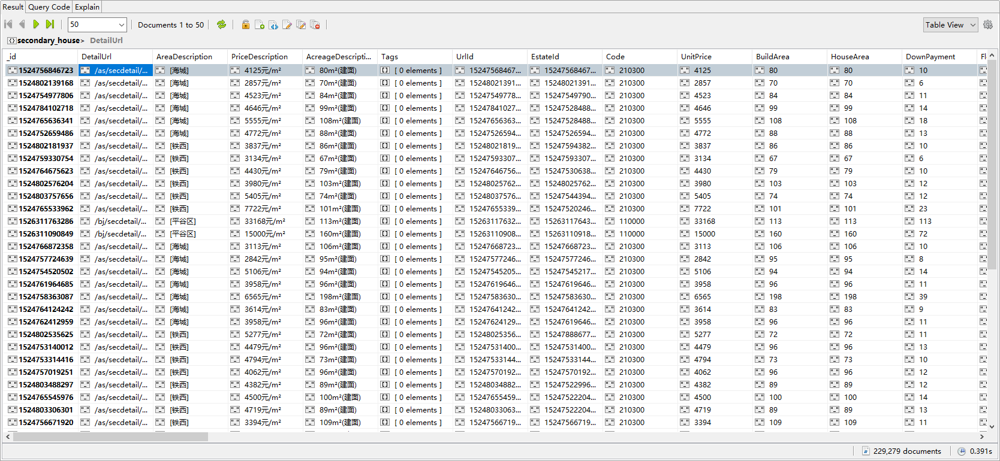

## 优居h5页面全国二手房爬虫
## 技术
&emsp; 用django的ORM和scrapy结合爬取优居全国二手房数据，mysql存city和region数据，二手房数据存入mongodb中
## 爬虫注意点
&emsp; 请求头必须是手机的，还有有的地区的接口的页数会一直返回数据，请求到后面返回的数据是相同的, 根据这个判断该地区是否爬取完成,爬取完成后会更新is_finish字段
## 运行:
1. 在ujuModels/db_settings.py中配置mysql和mongodb
2. 命令行切换至项目根目录下，运行命令：
```
pip install -r requirements.txt
python manage.py migrate  # 更新django表
scrapy crawl uju_city  # 先爬取支持的城市
scrapy crawl uju_region  # 然后爬取城市下面的地区和它的region_code
scrapy crawl uju_secondary  # 最后执行爬虫
```
## 数据

## 公告
&emsp; 本代码仅作学习交流，切勿用于商业用途，否则后果自负。若涉及侵权，请邮箱联系，会尽快处理。